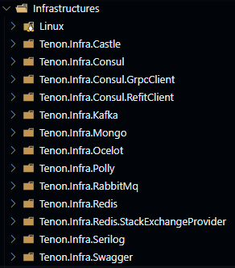
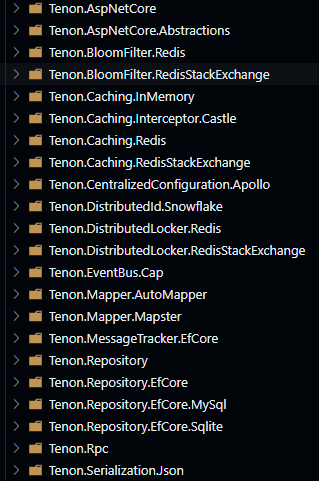

# Tenon

[](https://github.com/996icu/996.ICU/blob/master/LICENSE)

<h3 align="center">像搭积木一样按需构建项目功能</h3>

## ✨ 特性

- 🌈 服务治理：Consul
- 📦 分布式缓存：Redis+BloomFilter
- 🚀 分布式总线：Cap
- ⚙️ 分布式 ID：Snowflake
- 🎨 消息队列：RabbitMQ
- 🔒 数据库访问：Entity Framework Core & Repository
- 🌍 网关：Ocelot

## 🚀 结构

- Infrastructures <br>
  
- Extensions <br>
  
- Services <br>
  

## 📦 示例

- 🔒 数据访问

  定义 DbContext

  ```
  public sealed class MySqlTestDbContext(DbContextOptions options)
    : MySqlDbContext(options)
  {
    public DbSet<Blog> Blogs { get; set; }
    public DbSet<Post> Posts { get; set; }

    protected override void OnConfiguring(DbContextOptionsBuilder optionsBuilder)
    {
        // optionsBuilder.UseLazyLoadingProxies();
        optionsBuilder.EnableSensitiveDataLogging();
        optionsBuilder.LogTo(Console.WriteLine, LogLevel.Information);
    }

    protected override void OnModelCreating(ModelBuilder modelBuilder)
    {
        modelBuilder.Entity<Blog>().ToTable("blogs");
        modelBuilder.Entity<Post>().ToTable("posts");
        modelBuilder.ApplyConfigurations<MySqlTestDbContext>();
    }
  }
  ```

  使用 Repository

  ```
      [TestInitialize]
    public async Task Init()
    {
        using (var scope = _serviceProvider.CreateScope())
        {
            using (var context = scope.ServiceProvider.GetService<MySqlTestDbContext>())
            {
                await context.Database.EnsureDeletedAsync();
                await context.Database.EnsureCreatedAsync();
                var blog1 = new Blog { Url = "http://sample.com", Id = 1 };
                var post1 = new Post { Blog = blog1, Content = "test", Title = "test" };
                var blogRepository = new EfRepository<Blog>(context);
                var result = await blogRepository.InsertAsync(blog1);
                Assert.AreEqual(result > 0, true);
                var postRepository = new EfRepository<Post>(context);
                result = await postRepository.InsertAsync(post1);
                Assert.AreEqual(result > 0, true);

                var blog2 = new Blog { Url = "http://sample2.com", Id = 2 };
                var post2 = new Post { Blog = blog2, Content = "test2", Title = "test2" };
                result = await blogRepository.InsertAsync(blog2);
                Assert.AreEqual(result > 0, true);
                result = await postRepository.InsertAsync(post2);
                Assert.AreEqual(result > 0, true);

                var blog3 = new Blog { Url = "http://sample4.com", Id = 3 };
                var post3 = new Post { Blog = blog3, Content = "test3", Title = "test3" };
                result = await blogRepository.InsertAsync(blog3);
                Assert.AreEqual(result > 0, true);
                result = await postRepository.InsertAsync(post3);
                Assert.AreEqual(result > 0, true);

                var blog4 = new Blog { Url = "http://sample4.com", Id = 4 };
                var post4 = new Post { Blog = blog4, Content = "test4", Title = "test4" };
                result = await blogRepository.InsertAsync(blog4);
                Assert.AreEqual(result > 0, true);
                result = await postRepository.InsertAsync(post4);
                Assert.AreEqual(result > 0, true);
            }
        }
    }
  ```

- 📦 分布式缓存：Redis+BloomFilter

  依赖注入
  ```
      var configuration = new ConfigurationBuilder()
            .SetBasePath(Directory.GetCurrentDirectory())
            .AddJsonFile("appsettings.json", false)
            .Build();
        _serviceProvider = new ServiceCollection()
            .AddLogging(loggingBuilder => loggingBuilder
                .AddConsole()
                .SetMinimumLevel(LogLevel.Debug))
            .AddSystemTextJsonSerializer()
            .AddRedisStackExchangeProvider(configuration.GetSection("Redis"))
            .AddKeyedRedisStackExchangeProvider(_serviceKey, configuration.GetSection("Redis2"))
            .AddKeyedRedisStackExchangeProvider("abc", configuration.GetSection("Redis2"))
            .BuildServiceProvider();
     ```
  使用
    ```
    public void GetStandaloneServersTest()
        {
            using (var scope = _serviceProvider.CreateScope())
            {
                var redisDataBase = scope.ServiceProvider.GetService<RedisConnection>();
                Assert.IsNotNull(redisDataBase);
                var redisServer = redisDataBase.GetServers();
                Assert.IsTrue(redisServer.Any());
                var standaloneServer = redisServer.FirstOrDefault();
                Assert.IsNotNull(standaloneServer);
            }
        }
    ```
